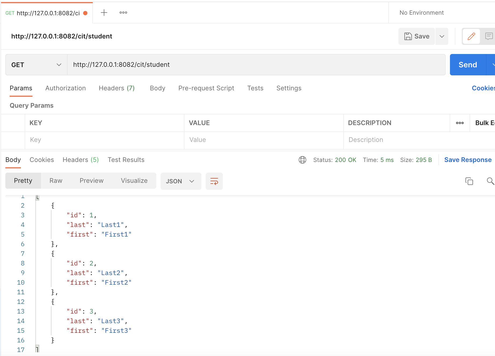
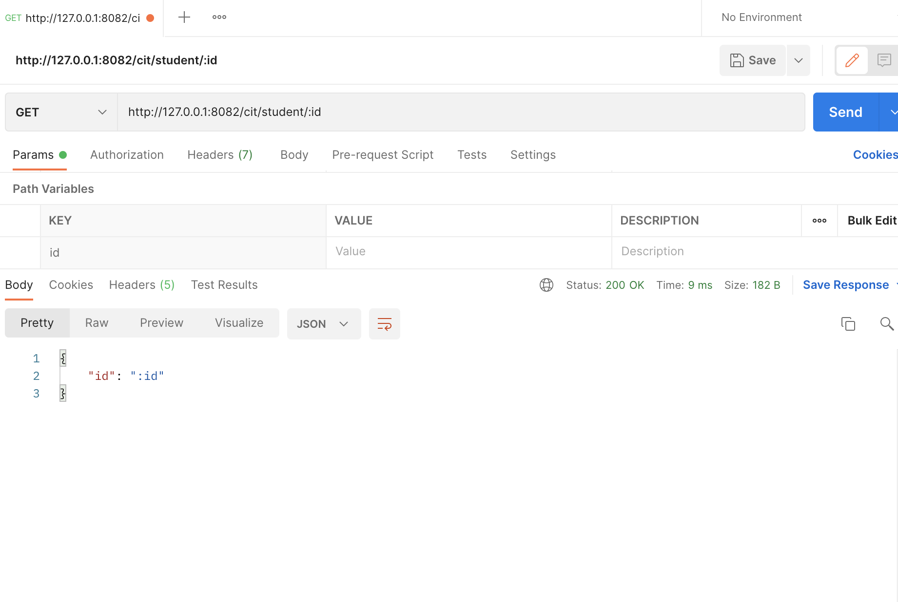
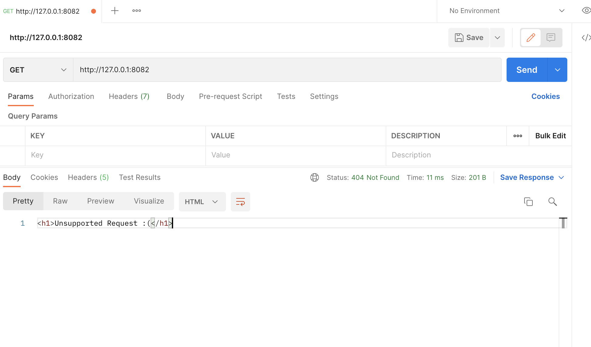

# cit281-lab5

## Lab Goals and Objectives 
1. Download and install Postman
2. Create a CIT 281 collection and folders
3. Create a Node.js and fastify server application with GET and respond with JSON
4. Add array of students object
5. Use Postman to test server GET routes
6. Add POST handling to server application and respond with JSON
7. Use Postman and POST request

### Lab Deliverables
1. [fastify-server.js](fastify-server.js)
2. [package.json](package.json)
3. AllStudents.png

4. SingleStudent.png

5. Unmatched.png

